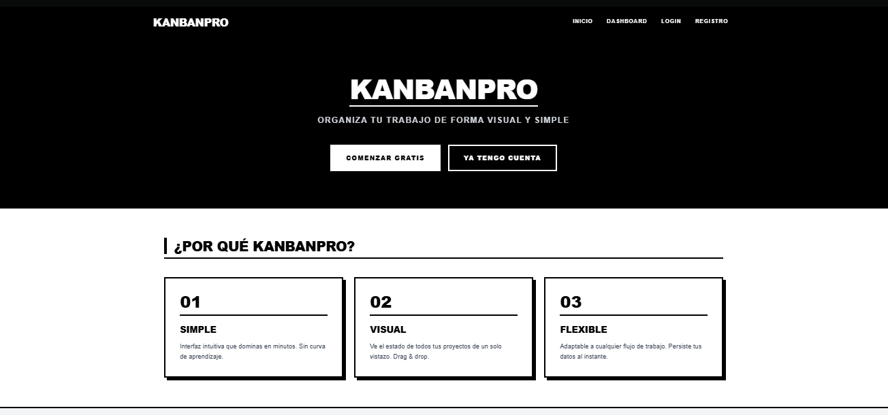

#  KANBANPRO

Proyecto Full Stack JavaScript: API RESTful + Frontend Handlebars + PostgreSQL

KanbanPro es una aplicación de gestión de proyectos tipo Kanban que permite a los usuarios crear tableros, listas y tarjetas, con autenticación segura y datos reales desde la base de datos.

📌 Problema que Resuelve

Antes, los usuarios tenían que usar métodos manuales o herramientas desconectadas para organizar sus tareas y proyectos.
KanbanPro centraliza todo en un tablero interactivo, permitiendo:

Gestión visual de tareas y proyectos.
Control de progreso mediante listas y tarjetas.
Acceso seguro y personalizado para cada usuario.

⚙️ Funcionalidades

Autenticación y Seguridad
Registro de usuarios con contraseña hasheada (bcryptjs).
Inicio de sesión con JSON Web Tokens (JWT).
Middleware que protege las rutas y asegura que solo usuarios autenticados accedan a sus datos.

Gestión de Proyectos

CRUD completo de tableros, listas y tarjetas.
Conexión de datos reales usando Sequelize + PostgreSQL.
Dashboard dinámico que refleja los cambios en tiempo real.
Frontend Interactivo
Renderizado de vistas con Handlebars.
Interfaz amigable y responsive usando Bootstrap 5.
Animaciones y efectos con GSAP (opcional).
Despliegue en Producción
Configurado para Vercel, con trust proxy y cookies seguras (httpOnly, sameSite).
Logs para verificar NODE_ENV.
CORS configurado para desarrollo y producción.

🛠️ Requisitos Técnicos

Backend: Node.js, Express, Sequelize, PostgreSQL
Frontend: Handlebars, Bootstrap 5, GSAP (opcional)
Seguridad: JWT, bcryptjs, cookies seguras
Despliegue: Vercel o similar, con soporte para Node.js y PostgreSQL

💻 Instalación Local

Clonar el repositorio:
git clone https://github.com/POLIVAF/KanbanPro.git
cd KanbanPro
Instalar dependencias:
npm install

Configurar variables de entorno (.env):
DB_HOST=localhost
DB_USER=tu_usuario
DB_PASS=tu_contraseña
DB_NAME=kanbanpro
JWT_SECRET=supersecreto
SERVER_PORT=3000
NODE_ENV=development

Ejecutar la app en local:
npm run dev
La app correrá en http://localhost:3000.
Sequelize sincroniza la base de datos solo en desarrollo.
🚀 Despliegue en Vercel
Quitamos app.listen() en producción.
Quitamos sequelize.sync() en producción (solo authenticate).
Configuramos trust proxy y CORS correctamente.
Incluimos las carpetas views/ y public/ en vercel.json.
Usamos cookies seguras:
res.cookie("token", token, {
  httpOnly: true,
  secure: true,
  sameSite: "none"
});
🔧 Momentos Técnicos Destacados
Autenticación JWT
Middleware verifica token en Authorization: Bearer [token] para proteger todas las rutas sensibles.
Sequelize con PostgreSQL
sequelize.authenticate() para conectar a DB.
sequelize.sync({ alter: true }) solo en desarrollo para no afectar producción.
Relación Tablero → Listas → Tarjetas totalmente funcional.
Vistas dinámicas con Handlebars
GET /dashboard obtiene datos reales de DB y los pasa a la plantilla.
Renderiza tableros, listas y tarjetas con lógica de controladores.

📝 Buenas Prácticas Nivel Empresa

Logs de entorno:
console.log("NODE_ENV:", process.env.NODE_ENV);
Separación de entornos (dev vs production).
Configuración de CORS para frontend local y producción.
Middleware de seguridad y cookies httpOnly + secure.

Estructura del proyecto

kanbanpro/
├── app.js                  # Entrada principal, configuración Express
├── vercel.json             # Configuración para Vercel
├── config/
│   └── sequelize.js        # Conexión a PostgreSQL
├── models/
│   ├── Usuario.js
│   ├── Tablero.js
│   ├── Lista.js
│   ├── Tarjeta.js
│   └── index.js            # Relaciones entre modelos
├── routes/
│   ├── api.routes.js
│   ├── auth.route.js
│   ├── tablero.routes.js
│   ├── lista.routes.js
│   └── tarjeta.routes.js
├── controllers/
│   ├── auth.controller.js
│   ├── tablero.controller.js
│   ├── lista.controller.js
│   └── tarjeta.controller.js
├── middlewares/
│   └── auth.middleware.js  # Verificación JWT
├── views/
│   ├── layouts/main.hbs
│   ├── home.hbs
│   ├── login.hbs
│   ├── register.hbs
│   └── dashboard.hbs
└── public/
    ├── kanban.js           # Lógica frontend (drag & drop, modales)
    └── style.css           # Tailwind compilado

📌 Aprendizajes y Retos

Integración completa de backend, frontend y base de datos.
Implementación de seguridad profesional con JWT y cookies seguras.
Adaptación de la app para despliegue en Vercel sin perder funcionalidad local.
Comprensión profunda de Sequelize y relaciones entre modelos.

⚡ Autor

Pablo Olivares F. – Full-Stack JavaScript 
GitHub